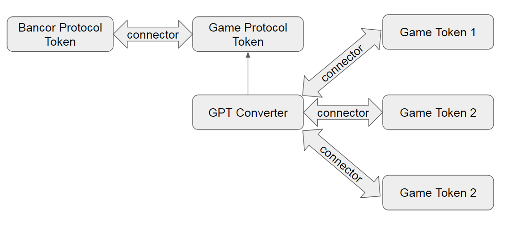

# Game Protocol Contracts

Game Protocol crowdsale and token contracts, using OpenZeppelin v1.9.0

## Testing

* truffle : v4.1.11
* solidity : v0.4.24
* ganache-cli : v6.1.0

To run test > npm test

# Game Starter

GameStarter is a one-stop crowdfunding platform for new game projects.

## Short Use Case

1. Initial registration and verification.
    * Registeration of the game/company on the Game starter website.
    * Verification of the account by the game starter team.
2. Deployment of contracts.
    * Deployment of the token for the project after the creator selects the token type and fills in the required constructor parameters.
    * Deployment of the crowdsale contract for the token.
    * Add Connector to the GPT converter with the newly created token.
3. After the end of the crowdsale, as we finalize the crowdsale, funds will be transfered from the crowdsale to the connector liquidity pool so the token could be converted with GPT and all other Bancor platform tokens.

## Sequence of events

1. Deploy GPToken - params=()
2. Deploy GPTCrowdsale - params=(openTime, closeTime, rate, wallet, gameSupport, bounty, advisors, team, token)
3. Deploy Converter - params=(GPToken, IBancorConverterExtensions, _maxConversionFee)
4. Deploy GameStarterFactory - params=(GPToken, Converter, feeWallet)

5. For every new game, call createGame function from GameStarterFactory - params=(owner, tokenName, tokenSymbol, openTime, closeTime, rate)  inside the function the following will happen:
    * Deploy SubToken - params(tokenName, tokenSymbol)
    * Deploy Crowdsale for the sub token - params=(openTime, closeTime, rate, owner, feeWallet, SubToken)
    * Call addConnector function in Convertor - params=(SubToken, weight, enableVirtualBalance)
    * Call updateConnector function in Convertor - params=(SubToken, weight, enableVirtualBalance, virtualBalance)

## Tokens Graph

## Crowdsale contract types

1. Basic crowdsale will be mintable and finilizable.
2. Bonus crowdsale will add to the Basic crowdsale bonuses depending on the time invested.
3. ...

## Questions

1. Virtual balance?
2. Just one converter?
3. Connector vs converter?
4. On buy, smart token is minted?
